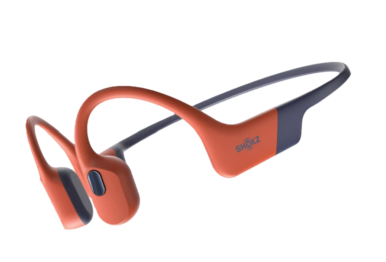

# TikTok 商品带货视频 Skill

从商品图片与卖点生成 15 秒 TikTok Shop 带货视频方案：先分析产品视觉特征，再输出可直接用于 Seedance 等视频模型的四段式分镜提示词和英文 UGC 口播。用户确认提示词后，才会提交视频生成任务。

## 能做什么

- 根据商品图识别品类、外观、可见结构与使用场景。
- 将卖点改写为「痛点冲突 → 功能演示 → 同场景对比 → 下单引导」的 15 秒分镜。
- 保持产品颜色、轮廓、比例和可见品牌与原图一致。
- 生成前提供完整提示词供修改；未得到明确确认时，不上传图片、不创建任务、不产生视频生成费用。
- 可选接入火山引擎 Ark / Seedance：本地图片上传到私有 TOS 后，使用短期签名链接作为参考图。

## 安装

将本仓库克隆或下载后，把整个目录放到 Codex 的 skills 目录，并确保目录名为 `tiktok-product-video`：

```text
$CODEX_HOME/skills/tiktok-product-video/
├── SKILL.md
├── agents/openai.yaml
└── references/prompt-spec.md
```

重新打开 Codex 后，直接描述你的需求，或在提示中使用：

```text
Use $tiktok-product-video to create a 15-second TikTok Shop video prompt from this product image and selling points.
```

## 使用方法

准备以下内容：

1. 至少一张清晰商品图。
2. 真实、允许使用的卖点、规格与数字。
3. 每次渲染指定模型 ID、分辨率和画幅比例；默认画幅为 `9:16`。

示例：

```text
为这张商品图制作 TikTok Shop 带货视频。
卖点：IP68 防水、32GB 本地存储、可在蓝牙与 MP3 间切换。
模型：doubao-seedance-2-0-fast-260128
分辨率：720p
画幅：9:16
```

Skill 会先返回完整分镜提示词和英文配音。你可以回复具体修改意见，例如“开头改成跑步场景”“不要出现价格”“语气更轻松”。只有回复“确认生成”或同等明确指令后，才会提交视频任务。

## 示例

以下为本 Skill 的一次示例输入与生成结果：

- [商品参考图](example/耳机.png)
- [15 秒生成视频](example/shokz-openswim-pro-test.mp4)



示例展示的是一款开放式运动耳机。实际生成结果受商品图、卖点、提示词和所选视频模型影响。

## 使用 Seedance 生成视频（可选）

若要实际调用火山引擎 Seedance，请在工作区创建本地文件 `.seedance.local.env`：

```env
ARK_API_KEY=
ARK_BASE_URL=https://ark.cn-beijing.volces.com/api/v3
TOS_ACCESS_KEY_ID=
TOS_SECRET_ACCESS_KEY=
TOS_BUCKET=
TOS_REGION=cn-beijing
TOS_ENDPOINT=tos-cn-beijing.volces.com
TOS_OBJECT_PREFIX=seedance-inputs/
TOS_URL_TTL_SECONDS=1800
```

安全建议：

- 使用 IAM 子用户或 STS 临时凭据；仅授予指定桶与 `seedance-inputs/*` 前缀的 `GetObject`、`PutObject` 权限。
- 存储桶保持私有；不要设置公共读写 ACL。
- 不要在聊天、提示词、截图、代码或 Git 仓库中粘贴任何密钥。
- 把 `.seedance.local.env` 加入 `.gitignore`，并为上传对象设置生命周期清理规则。

## 工作流

1. 输入商品图、卖点与渲染参数。
2. 视觉分析并生成完整 15 秒提示词。
3. 修改提示词，或明确确认生成。
4. 确认后上传参考图并提交生成任务。
5. 首次状态查询在任务创建约 1 分钟后执行；失败时仅安排一次 5 分钟后的复查，不会自动重复扣费提交。

## 内容约束

只使用图片或用户明确提供的信息。不要编造参数、认证、防水等级、性能结果、价格或竞品结论；对比仅使用泛化的普通同类产品，不点名真实品牌。
